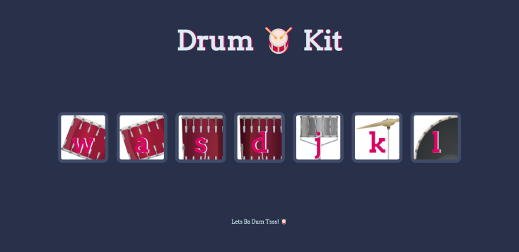

# 🥁 Drum Kit

A Drum Kit with number of keys that represent different drums in a typical drum set and produce the corresponding sound when cliked or typed. 
This project implements DOM Manipulation and Event Listeners using JavaScript.

## Deployment

Deployed Website : https://stutisharma273.github.io/Drum-Kit/

## Built With

  * HTML
  * CSS
  * Javascript
  
## Authors

  [Stuti Sharma](https://github.com/StutiSharma273)
  
## Acknowledgements

  * The Complete 2022 Web Development Bootcamp by [Angela Yu](https://github.com/angelabauer)
